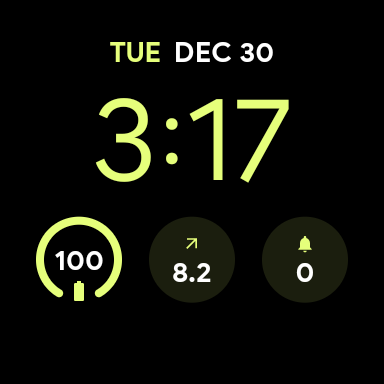
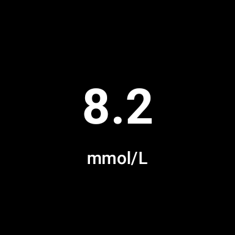
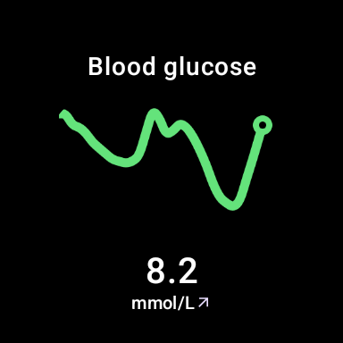
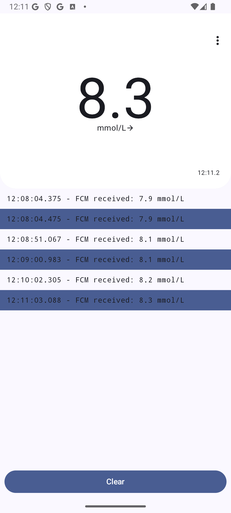

# GlucoView

A project for bringing blood glucose data from freestyle libre CGMs to wear os devices via the LibreView API.

## 📁 Repositories

- [Server](https://github.com/RuiNiles/glucoview-server)
- [Client](https://github.com/RuiNiles/glucoview-app)

## 💡 Overview

GlucoView is a two-part system that fetches real-time blood glucose data from LibreView and delivers it to
Android and Wear OS devices.

### How it works

- **Data Upload**: The Freestyle Libre / LibreLink app automatically uploads glucose readings to the LibreView cloud
  service.
- **Server Polling**: The GlucoView Server regularly polls the LibreView API for the latest glucose readings.
- **Event Push**: When new data is available, the server sends a Firebase Cloud Message (FCM) to registered GlucoView client
  devices.
- **Client Sync**: The GlucoView Android client receives the FCM payload and updates its local data store.
- **Wear OS Integration**: If a paired Wear OS device has GlucoView installed, the Android app forwards the new readings to
  the watch, ensuring tiles and complications stay up to date.

**This architecture ensures that devices are kept up to date with minimal delay or battery impact.**

### Architecture Diagram

## 📷 Screenshots

### ⌚ Complication

 

### ⌚ Tiles

 

### 📱 Phone Dashboard

## 🚀 Quick Start

1. TODO